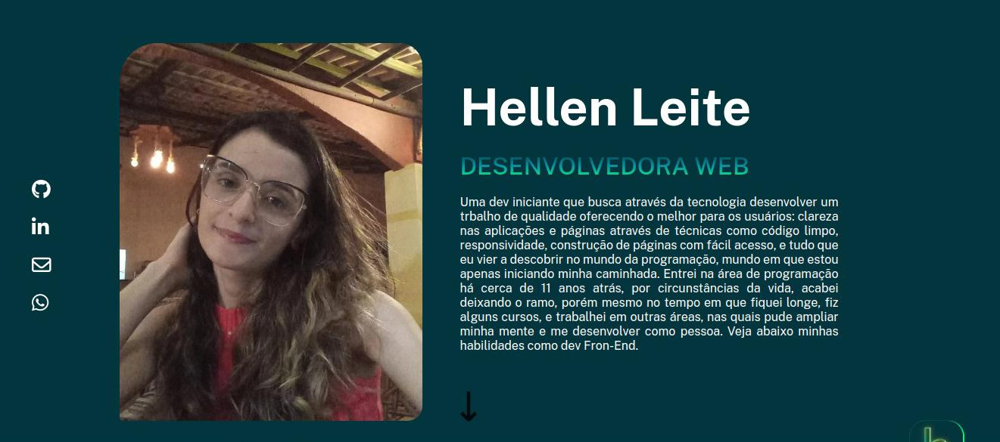
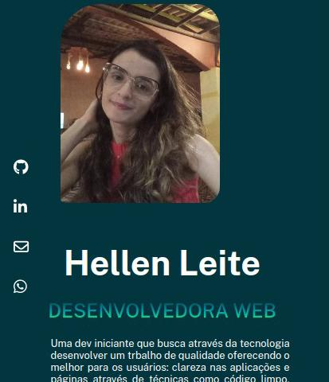
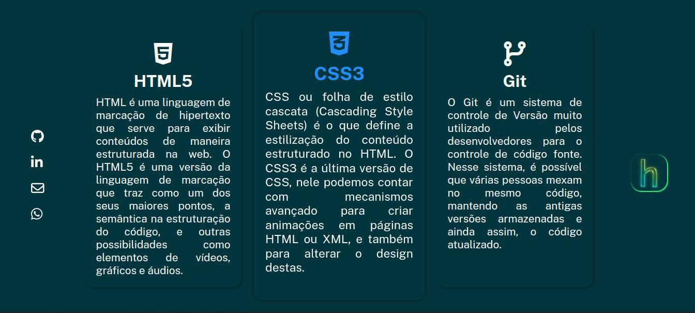
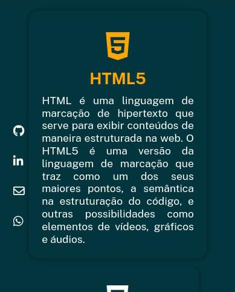
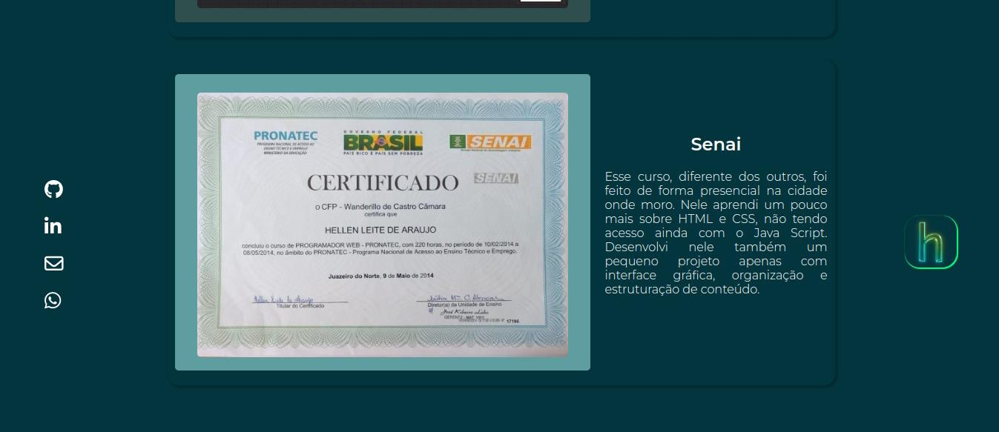
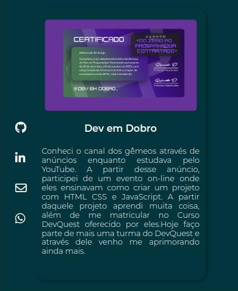
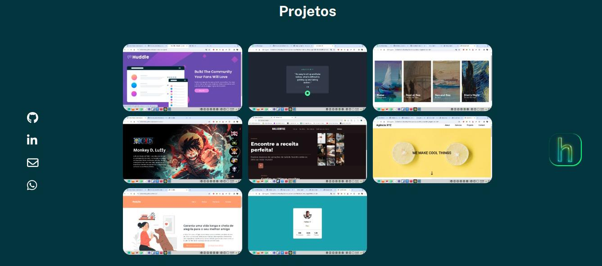
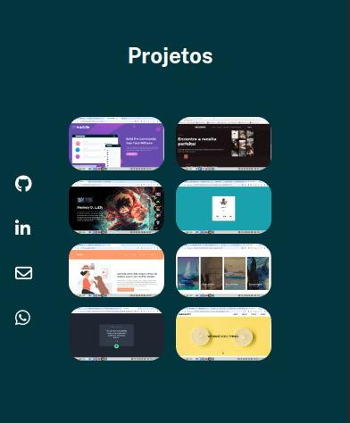
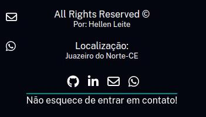

# Meu Portfólio
## Este é, antes de tudo o meu primeiro projeto construído apenas com conhecimentos adquiridos por mim, em dois meses de estudo focado em HTML e CSS. Vale fomentar que já participei de construções de outras páginas, mas sempre guiada por instrutores através de aulas.
### Segue abaixo as sessões da minha página:
<ul>
    <li><a href="#cabecalho">Header</a></li>
    <li><a href="#sobre">Sobre</li>
    <li><a href="#habilidades">Habilidades</a></li>
    <li><a href="#certificados">Certificados</a></li>
    <li><a href="#projetos">Projetos</a></li>
    <li><a href="#contato">Contato</a></li>
</ul>

<h3 id="#cabecalho">Header</h3>

 Aqui construi um header com uma logo, ao lado esquerdo, e à direita uma nav, que no responsivo, se transforma em menu hambúrguer.Veja as duas versões: 

<h3 id="sobre">Sobre</h3>

Nessa parte do site, escrevi um pouco sobre mim, deixando a parte desktop em linha, por meio do display flex padrão, e na parte responsiva, também utilizei o display flex, mas usando o flex-direction:column, para que os elementos ficassem agrupados em coluna, cabendo nas telas mobile e deixando a página dinâmica e acessível visualmente.Segue abaixo as duas versões: 

<h3 id="#habilidades">Habilidades</h3>

 Nessa sessão falei um pouco sobre minhas habilidades que são, HTML, CSS, e Git. Elucidei sobre as mesmas através de cards, e assim como na sessão anterior, no desktop utilizei o modelo em linha do display flex, e column no responsivo. 

<h3 id="certificados">Certificados</h3>

 Aqui apresentei um pouco da minha história no mundo da programação. Segui a mesma lógica das outras sessões no flex. Tive muita atenção ao montar essa sessão tanto na versão responsiva, quanto no breakpoint do desktop, uma vez que deixei as imagens visíveis tanto o quanto pude, e para organizar, tive que dividir bastante.

<h3 id="projetos">Projetos</h3>

 Na sessão de projetos coloquei projetos que fiz, junto ao curso Dev em Dobro, com tentativas e auxílio dos prfessores, e outros projetos que contrui por meio de vídeos no YouTube.

<h3 id="contato">Contatos</h3>

Para contato, deixei o footer, lá coloquei redes como GitHub, Linkedin, whatsapp e também meu email. Preferi não construir formulários, uma vez que os dados ali inseridos, não seriam de fato enviados para um servidor.

## Tecnologias utilizadas

    
   

## Desafio

 Levando em conta que foi o primeiro projeto a ser feito por mim, sozinha, encontrei muitos desafios, e ao mesmo tempo, pude analisar aquilo no que ainda preciso melhorar. Sei que ainda tenho muito a conhecer das três tecnologias aqui utilizadas, e ao mesmo tempo provo para mim mesma o que aprendi com esforço e dedicação. Todo conhecimento se constrói diariamente, e com a tecnologia não poderia ser diferente. Espero ter mostrado o que pretendo realizar em meus futuros trabalhos como programadora, e crescer muito nessa área tão instigante. 
